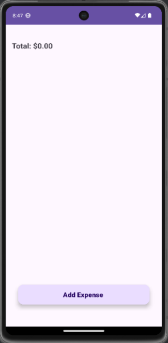
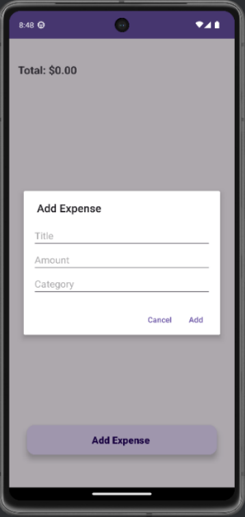
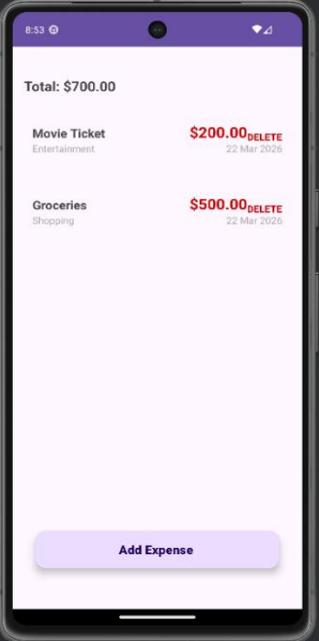

# Expense Tracker App

## Overview
Expense Tracker App is an Android application developed using Kotlin to help users manage their daily expenses efficiently.

## Features
- Add new expenses
- Delete expenses
- View all expenses using RecyclerView
- Calculate total expenses automatically
- Store data locally using Room Database

## Technologies Used
- Kotlin
- Android Studio
- Room Database
- MVVM Architecture
- LiveData
- RecyclerView
- Material Design

## Project Structure
```
app/
├── data/
├── repository/
├── ui/
├── viewModel/
└── res/
```

## How to Run
1. Clone the repository.
2. Open the project in Android Studio.
3. Sync Gradle.
4. Run the application on an emulator or Android device.

## Author
Dhanya Sri M

## 📸 Screenshots

### Home Screen


### Add Expense


### Expense List

